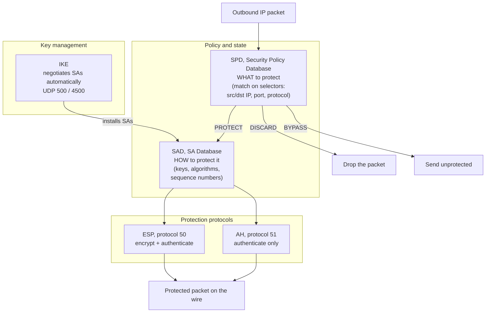
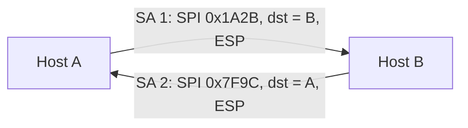
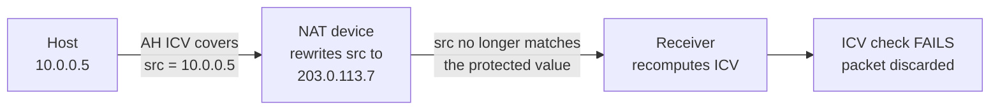
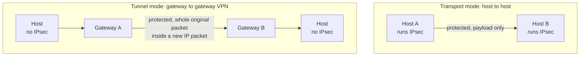
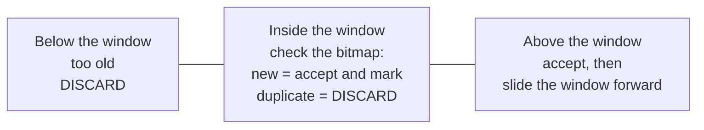
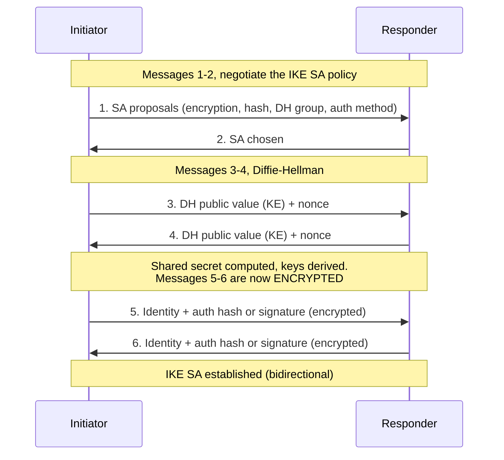
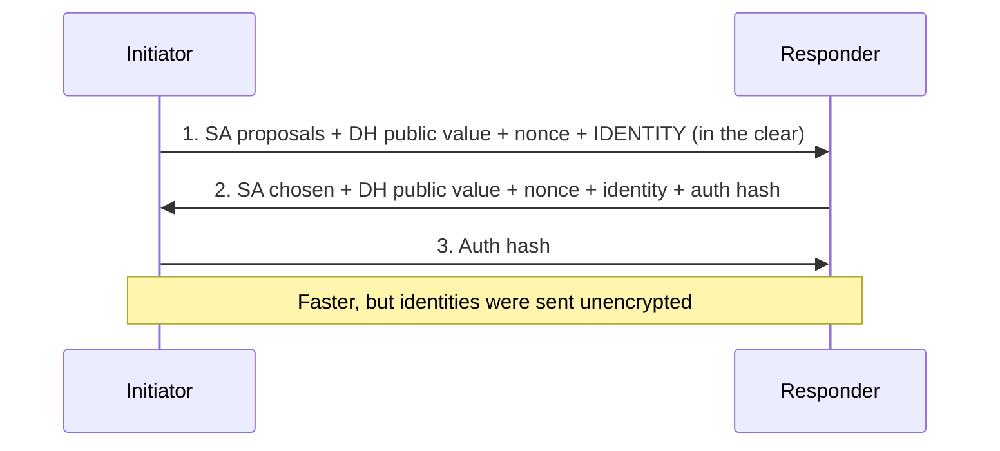
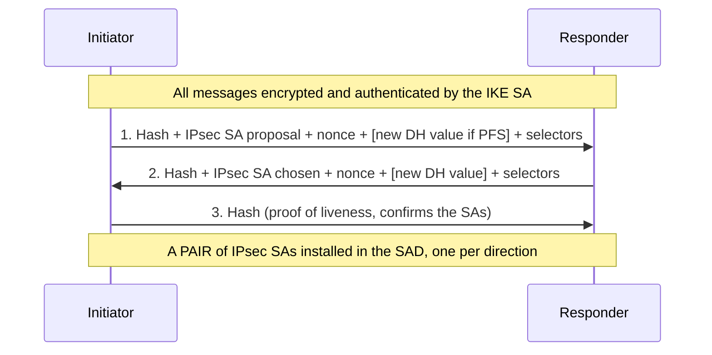
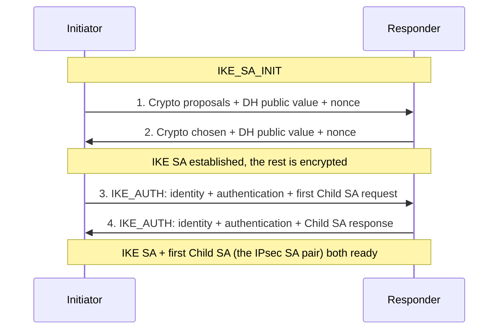

# Deep Dive: IPsec (AH, ESP, Modes, IKE)

**Covers checklist topics 7 and 8. Unit I, CO1. Expect a full 10-mark question.**

Diagrams are **mermaid**. They render on GitHub, and in VS Code you need the
*Markdown Preview Mermaid Support* extension (then Ctrl+Shift+V). Packet layouts
are given as **tables** rather than diagrams, because what matters in an exam is
exactly which fields are encrypted and which are authenticated, and a table
states that without ambiguity.

---

## 1. Why IPsec exists

Plain IP offers **nothing**:

| IP provides no | Consequence |
|---|---|
| Source authentication | Anyone can **spoof** a source address |
| Integrity | A router or MITM can **modify** a packet undetected |
| Confidentiality | Every payload travels in **cleartext** |
| Replay protection | A captured packet can be **resent** |

IPsec adds authentication, integrity, confidentiality and anti-replay **at the
network layer**. That placement is the whole design decision, and it is the same
trade-off you learned in checklist topic 5:

- **Transparent** to applications and users. No application needs recompiling.
- Protects **all** IP traffic, including routing protocols, not just TCP.
- Deploy **once at a gateway** and every host behind it is covered.
- But: **no per-user granularity** (it is per-host or per-SA), and it **fights NAT**.

Stallings lists the applications: secure branch-office connectivity over the
Internet, secure remote access, extranet and intranet connectivity with
partners, and enhancing electronic commerce security.

---

## 2. The architecture in one picture

Three ideas to carry away, and they are frequently a 5-mark question on their own:

1. The **SPD** answers *what should be protected*. Every outbound packet is
   matched against it and gets one of three verdicts: **PROTECT, BYPASS, DISCARD**.
2. The **SAD** answers *how*, holding the actual keys, algorithms and counters.
3. **IKE** exists only to populate the SAD without a human typing keys.

---

## 3. Security Association (SA)

An SA is the agreement between two peers about how they will protect traffic.

**The two facts examiners test:**

> An SA is **one-way (simplex)**. Protecting a two-way conversation therefore
> needs **two SAs**, one per direction.

> An SA is uniquely identified by a **triple**:
> **SPI** (Security Parameters Index, 32 bits) + **destination IP address** +
> **security protocol identifier** (AH or ESP).

Note the asymmetry that trips people up: the destination address in the triple
means each SA is named from the **receiver's** point of view. When B receives a
packet it looks up the SA using the SPI in the header plus its own address.

**What an SA record holds:** sequence number counter, anti-replay window, AH or
ESP algorithm and keys, SA lifetime, protocol mode (transport or tunnel), and
path MTU.

**Contrast with the IKE SA (a favourite trick question):** IPsec SAs are
**simplex and come in pairs**. The **IKE SA** created in Phase 1 is
**bidirectional**, a single SA covering both directions.

---

## 4. AH, Authentication Header (RFC 4302, protocol 51)

**AH gives integrity, data-origin authentication and anti-replay. It gives no
confidentiality.** Nothing is encrypted. Anyone can read the payload; they just
cannot change it without detection.

### Header fields

| Field | Size | Purpose |
|---|---|---|
| Next Header | 8 bits | Type of the following payload (for example 6 for TCP) |
| Payload Length | 8 bits | Length of AH itself, in 32-bit words minus 2 |
| Reserved | 16 bits | Zero |
| **SPI** | 32 bits | Identifies the SA |
| **Sequence Number** | 32 bits | Monotonically increasing, gives anti-replay |
| **ICV** | variable | Integrity Check Value, a **MAC** (HMAC-SHA-256 etc.) |

### What AH authenticates, and the mutable-field problem

AH is the only IPsec protocol that covers the **outer IP header**. But some IP
header fields legitimately change at every hop, so they must be excluded or the
ICV would fail on arrival.

| IP header field | Included in the ICV? | Why |
|---|---|---|
| Source and destination address | **Yes** | Immutable end to end |
| Protocol, version, total length, identification | **Yes** | Immutable |
| **TTL / Hop Limit** | **No** | Decremented by every router |
| **Header Checksum** | **No** | Recomputed at every hop |
| **Type of Service / DSCP** | **No** | Routers may remark it |
| **Flags, Fragment Offset** | **No** | Changed by fragmentation |

Mutable fields are treated as **zero** when computing the ICV.

### Why AH breaks NAT

This is the single most examinable fact about AH.

AH deliberately protects the source and destination addresses. NAT's entire job
is to rewrite them. The two are **fundamentally incompatible**, and unlike ESP
there is no workaround. This, more than anything, is why AH is effectively
**deprecated** in favour of ESP.

---

## 5. ESP, Encapsulating Security Payload (RFC 4303, protocol 50)

ESP gives **confidentiality**, plus **optional** integrity, data-origin
authentication and anti-replay. In practice the optional parts are always
enabled, because encryption without integrity is unsafe.

### Fields, and note where they sit

| Field | Position | Encrypted? | Purpose |
|---|---|---|---|
| SPI, 32 bits | Header | No | Identifies the SA. Must be readable to find the key |
| Sequence Number, 32 bits | Header | No | Anti-replay. Readable so replays are dropped before decryption |
| Payload Data | Middle | **Yes** | The protected data, plus the IV if the cipher needs one |
| Padding | **Trailer** | **Yes** | Aligns to the cipher's block size, can also hide the true length |
| Pad Length, 8 bits | **Trailer** | **Yes** | How much padding |
| **Next Header**, 8 bits | **Trailer** | **Yes** | Type of the protected payload |
| ICV | End | No, it *is* the check | MAC over the ESP header, payload and trailer |

Two points worth a mark each:

- The SPI and sequence number are **outside** the encryption on purpose. The
  receiver must find the SA and reject replays *before* spending CPU on decryption.
- **Next Header is in the trailer**, so it is encrypted. That hides what protocol
  is inside, which is part of traffic-flow confidentiality.

### Why ESP survives NAT

ESP's ICV covers the ESP header onwards, **not** the outer IP header. So NAT can
rewrite addresses freely. There is still a snag: NAT usually needs port numbers
to multiplex, and ESP has none. The fix is **NAT-T** (NAT Traversal, RFC 3948),
which wraps ESP inside **UDP port 4500**.

---

## 6. AH vs ESP

| | **AH** | **ESP** |
|---|---|---|
| RFC | 4302 | 4303 |
| IP protocol number | **51** | **50** |
| Confidentiality | **No** | **Yes** |
| Integrity and data-origin authentication | Yes | Optional, always used in practice |
| Anti-replay | Yes | Yes |
| Authenticates the **outer IP header** | **Yes**, immutable fields | **No** |
| Works through NAT | **No**, unfixable | Yes, with **NAT-T** on UDP 4500 |
| Traffic-flow confidentiality (tunnel mode) | No | Yes |
| Status today | Largely **deprecated** | Dominant |

**The one-line conclusion to write:** ESP does everything AH does *plus*
encryption, and it survives NAT. AH's only remaining advantage is authenticating
the outer IP header, which is rarely worth losing NAT compatibility for.

---

## 7. Transport mode vs tunnel mode

> **Transport mode protects the IP payload. Tunnel mode protects the entire
> original IP packet, by encapsulating it inside a new one.**

| | Transport mode | Tunnel mode |
|---|---|---|
| Protects | IP **payload** only | The **entire original IP packet** |
| IP header | Original kept, no new header | **New outer IP header** added |
| Endpoints of the SA | The **communicating hosts** | Usually **security gateways** |
| Who must run IPsec | Both end hosts | Only the gateways |
| Typical use | End-to-end, host to host | **Site-to-site VPN**, remote access |
| Traffic-flow confidentiality | No, real addresses visible | **Yes**, only gateway addresses visible |
| Overhead | Lower | Higher, extra 20-byte IP header |

**The rule for when tunnel mode is mandatory:** whenever **either end of the SA
is a security gateway acting on behalf of other hosts**. A gateway must carry the
original packet intact so it can deliver it to the real destination, and only
tunnel mode does that. Transport mode is for when the IPsec endpoint *is* the
traffic endpoint.

### The four packet layouts

Original packet, for reference:

| IP hdr | TCP hdr | Data |
|---|---|---|

**AH, transport mode**

| | IP hdr | **AH** | TCP hdr | Data |
|---|---|---|---|---|
| Encrypted | no | no | no | no |
| Authenticated | **yes, immutable fields only** | yes | yes | yes |

**AH, tunnel mode**

| | new IP hdr | **AH** | orig IP hdr | TCP hdr | Data |
|---|---|---|---|---|---|
| Encrypted | no | no | no | no | no |
| Authenticated | **yes, immutable fields only** | yes | **yes, in full** | yes | yes |

**ESP, transport mode**

| | IP hdr | **ESP hdr** | TCP hdr | Data | ESP trailer | ESP ICV |
|---|---|---|---|---|---|---|
| Encrypted | no | no | **yes** | **yes** | **yes** | no |
| Authenticated | **no** | yes | yes | yes | yes | it *is* the ICV |

**ESP, tunnel mode**

| | new IP hdr | **ESP hdr** | orig IP hdr | TCP hdr | Data | ESP trailer | ESP ICV |
|---|---|---|---|---|---|---|---|
| Encrypted | no | no | **yes** | **yes** | **yes** | **yes** | no |
| Authenticated | **no** | yes | yes | yes | yes | yes | it *is* the ICV |

Read the pattern rather than memorising four rows:

- **Tunnel mode demotes the original IP header to payload**, which is exactly why
  it can be encrypted, and therefore why only tunnel mode hides the real endpoints.
- **Transport mode must leave the IP header in the clear**, because routers need
  it to forward the packet.
- **AH authenticates the outer header; ESP never does.**

### How to draw this in the exam

Draw a horizontal strip of boxes left to right in packet order, then two
**braces or arrows underneath**, one labelled "encrypted" and one labelled
"authenticated", each spanning the right boxes. Label the protocol and mode
above the strip. Examiners are looking for the correct **spans**, so the two
underneath brackets are where the marks are.

---

## 8. Anti-replay

Both AH and ESP carry a 32-bit **sequence number** that starts at 1 and
increases monotonically. The sender must never let it wrap; if it would, a new SA
must be negotiated. The receiver keeps a **sliding window**, default size **64**.

The window exists because IP may reorder packets, so "not the next number" is
not the same as "a replay". **Extended Sequence Numbers (ESN)** widen the counter
to 64 bits for high-speed links.

Note the ordering advantage of ESP: the sequence number is unencrypted, so a
replayed packet is thrown away **before** any decryption work happens, which is
itself a DoS mitigation.

---

## 9. IKE, Internet Key Exchange

### Why it exists

IPsec needs keys in the SAD. Typing them by hand ("manual keying") does not
scale: `n` peers need `n(n-1)/2` key pairs, keys are never rotated, and there is
no way to get forward secrecy. **IKE negotiates SAs automatically.**

- Runs over **UDP port 500**, plus **UDP 4500** when NAT-T is in use.
- IKEv1: RFC 2409. IKEv2: **RFC 7296**.

### The three components

| Component | RFC | Contribution |
|---|---|---|
| **ISAKMP** | 2408 | The generic **framework**: message formats, header, payload types, and the state machine for negotiation. It carries no key-exchange algorithm of its own |
| **Oakley** | 2412 | The **key-determination protocol**, based on **Diffie-Hellman**, adding cookies against clogging, DH groups, and nonces against replay |
| **SKEME** | - | Key-exchange techniques, contributing the ideas for authentication and fast rekeying |

The memory hook: **ISAKMP is the envelope, Oakley is the letter.** ISAKMP defines
how to talk, Oakley defines what is actually agreed.

Because Oakley is Diffie-Hellman, everything you already know about D-H applies
here, including the MITM weakness. Peers agree on a **DH group** (group 2, 5, 14
and so on, each a fixed prime and generator), and the exchange **must be
authenticated** to defeat MITM. That is what Phase 1 authentication is for.

### IKEv1 Phase 1, Main Mode (6 messages)

Purpose: mutually authenticate the peers and build the **IKE SA**, a secure
channel that Phase 2 will then negotiate inside.

The reason main mode takes six messages is that the identities are deliberately
held back until **after** the D-H exchange has produced a key, so they can be
sent encrypted. That is what "main mode provides **identity protection**" means.

### IKEv1 Phase 1, Aggressive Mode (3 messages)

| | Main mode | Aggressive mode |
|---|---|---|
| Messages | **6** | **3** |
| Identity protection | **Yes**, sent encrypted | **No**, sent in the clear |
| Speed | Slower | Faster |
| DoS resistance | Better | Worse, the responder does DH work early |
| Typical use | Site-to-site with known peers | Remote access with dynamic IPs |

### IKEv1 Phase 2, Quick Mode (3 messages)

Purpose: negotiate the actual **IPsec SAs** for AH or ESP. Every message is
protected by the IKE SA from Phase 1.

Two things to say in an answer here:

- Phase 2 installs **two** IPsec SAs, because IPsec SAs are simplex.
- If a **fresh Diffie-Hellman** is run in quick mode, the session gets
  **Perfect Forward Secrecy**: compromising the Phase 1 key later does not
  reveal past traffic. Without it, Phase 2 keys are derived from the Phase 1 secret.

**Message count summary:** main mode + quick mode = **6 + 3 = 9** messages.
Aggressive mode + quick mode = **3 + 3 = 6** messages.

### IKEv2 (RFC 7296)

IKEv2 replaces the whole two-phase structure with **four messages** in two
exchanges, and creates the first IPsec SA as part of them.

| IKEv1 | IKEv2 |
|---|---|
| Phase 1 (6 or 3) + Phase 2 (3) | **IKE_SA_INIT (2) + IKE_AUTH (2) = 4** |
| Main and aggressive modes | One exchange, no modes |
| "Phase 2 SA" | **Child SA**, created by `CREATE_CHILD_SA` |
| NAT traversal bolted on | **Built in** |
| No EAP | **EAP** supported, good for remote users |
| Weak DoS handling | **Cookies** as anti-clogging defence |
| No built-in liveness check | Liveness check / dead-peer detection |
| Asymmetric authentication not allowed | Each side may authenticate differently |

**The cookie mechanism, worth naming:** if the responder is under load it replies
with a **cookie** and does no Diffie-Hellman work until the initiator echoes that
cookie back. This proves the initiator can receive at its claimed address, which
defeats **spoofed-source flooding**. This is a direct link to Unit II: it is a
DoS mitigation, and it is the same idea as **SYN cookies**.

### Authentication methods

IKE must authenticate the D-H exchange or MITM defeats it. The options:

| Method | How it works | Weakness |
|---|---|---|
| **Pre-shared key (PSK)** | A shared secret both sides know | Does not scale, and aggressive mode + PSK leaks a crackable hash |
| **Digital signature (RSA/ECDSA)** | Sign the exchange, verify with the peer's public key | Needs key distribution |
| **Public-key certificates (X.509)** | Signature plus a CA-issued certificate | Needs a PKI |
| **EAP** (IKEv2 only) | Defers to an EAP method / RADIUS | IKEv2 only |

---

## 10. Exam answer skeletons

**"Explain IPsec and its components." (10 marks)**
Definition and layer → why IP needs it → the architecture diagram (SPD, SAD, AH,
ESP, IKE) → SA and its triple → AH vs ESP table → transport vs tunnel table with
one packet diagram → one line on IKE → conclusion naming a VPN as the application.

**"Compare AH and ESP." (5 marks)**
Use the table in section 6. Include protocol numbers 51 and 50, the outer-header
row, and the NAT row. Finish with the "why ESP won" sentence.

**"Distinguish transport and tunnel mode." (5 marks)**
The one-line distinction first, then the table, then **draw one packet layout for
each**. The diagram is where the marks are.

**"Explain IKE and its phases." (10 marks)**
Why manual keying fails → UDP 500/4500 → ISAKMP, Oakley, SKEME with one line each
→ Phase 1 main vs aggressive with the message counts → Phase 2 quick mode →
message-count arithmetic (9 vs 6) → PFS → one line on IKEv2's four messages →
conclusion that IKE is Diffie-Hellman plus authentication.

**"How does IPsec prevent replay attacks?" (2 to 5 marks)**
32-bit monotonic sequence number in both AH and ESP, receiver sliding window of
default size 64, duplicates and too-old packets discarded, new SA required before
the counter wraps, ESN extends it to 64 bits.

**Likely tricky one-liners**
- Which protocol number is AH? **51.** ESP? **50.**
- Is an SA one-way or two-way? **One-way. The IKE SA is two-way.**
- Which mode hides the real endpoints? **Tunnel.**
- Which protocol survives NAT? **ESP, with NAT-T on UDP 4500.**
- Which layer is IPsec at, and what does that buy? **Network layer, transparency to applications.**

---

## 11. Verified external resources

Checked and working as of September 2026.

### Primary standards, for exact wording

- [RFC 4301, Security Architecture for IP](https://datatracker.ietf.org/doc/html/rfc4301) - the SPD, SAD and SA definitions
- [RFC 4302, IP Authentication Header](https://datatracker.ietf.org/doc/html/rfc4302) - AH, protocol 51
- [RFC 4303, IP Encapsulating Security Payload](https://datatracker.ietf.org/doc/html/rfc4303) - ESP, protocol 50, and the anti-replay window
- [RFC 7296, IKEv2](https://datatracker.ietf.org/doc/html/rfc7296) - the four-message exchange and cookies

Use these to settle a disputed detail, not as study material. They are reference
documents, not tutorials.

### Best explanations, in the order I would use them

1. [Firewall.cx, IPSec modes](https://www.firewall.cx/networking/network-protocols/ipsec-modes.html) - clearest transport vs tunnel packet diagrams on the free web. Start here.
2. [NetworkLessons, IPsec](https://networklessons.com/vpn/ipsec-internet-protocol-security) - solid end-to-end walkthrough of AH, ESP and both modes with diagrams.
3. [Cisco, Understand IPsec IKEv1 Protocol](https://www.cisco.com/c/en/us/support/docs/security-vpn/ipsec-negotiation-ike-protocols/217432-understand-ipsec-ikev1-protocol.html) - the authoritative free write-up of main, aggressive and quick mode, message by message. Best single source for topic 8.
4. [Omnisecu, IKEv1 main, aggressive and quick mode exchanges](https://www.omnisecu.com/tcpip/ikev1-main-aggressive-and-quick-mode-message-exchanges.php) - short and exam-shaped, lists each message's payloads.
5. [Palo Alto Networks, What is IKE](https://www.paloaltonetworks.com/cyberpedia/what-is-ike) - good plain-English framing of why IKE exists, if the mechanics feel abstract.
6. [NetBird, Understanding the IKEv1 protocol](https://netbird.io/knowledge-hub/understanding-the-ikev1-protocol-in-ipsec) - a readable modern take on the two phases.

### Video

- [IPsec Explained: AH, ESP, Tunnel vs Transport Mode](https://www.youtube.com/watch?v=G6zOeUrSpPg) - covers exactly topics 7 and 8 in one sitting.
- [Practical Networking, VPN Deep Dive](https://www.practicalnetworking.net/classes/vpn-deep-dive/) - the best structured treatment anywhere, with modules on AH, ESP, transport mode, tunnel mode, ISAKMP and IKE Phase 1 main vs aggressive. It is a paid class, but the module list alone is a good revision checklist, and their free [Diffie-Hellman article](https://www.practicalnetworking.net/series/cryptography/diffie-hellman/) is the best explanation of the D-H you just learned.

### Exam-style answers, Indian university format

- [Ques10, transport vs tunnel mode](https://www.ques10.com/p/9081/differentiate-between-the-tunnel-mode-and-transpor/) - shows the answer *length and shape* expected in this exam format. Useful for calibration, but verify the technical detail against the RFCs or Cisco, since crowd-sourced answers contain errors.

### What to skip

Vendor glossary pages (Twingate, Check Point, TutorialsPoint and similar) are
accurate but too thin for a 10-mark answer. They will not tell you about the
mutable-field problem, the SA triple, or the message counts.
